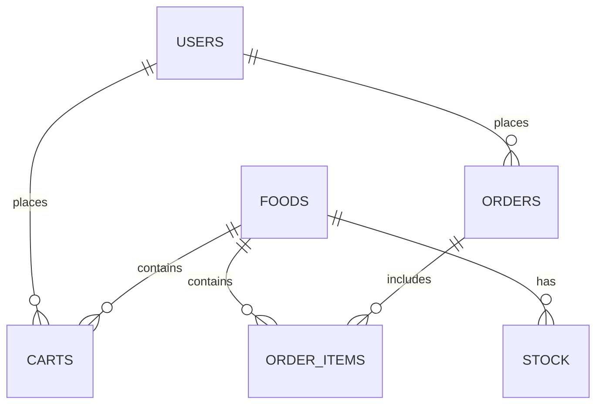

# Database Documentation

## Overview
This document describes the database schema for the KIIT Kafe Campus 25 Ordering System. The database is designed to support user authentication, menu management, inventory tracking, shopping cart functionality, and order processing.

## Database Name
- `kiit_kaffe_db`

## Tables

### 1. Users Table
Stores all user information for authentication and role management.

| Column | Type | Description |
|--------|------|-------------|
| `id` | INT AUTO_INCREMENT PRIMARY KEY | Unique identifier for each user |
| `name` | VARCHAR(100) NOT NULL | Full name of the user |
| `email` | VARCHAR(100) NOT NULL UNIQUE | Unique email address for login |
| `password` | VARCHAR(255) NOT NULL | Securely hashed password |
| `phone` | VARCHAR(20) | Contact number |
| `role` | ENUM('user', 'admin') DEFAULT 'user' | Defines if the user is a 'user' or an 'admin' |
| `created_at` | TIMESTAMP DEFAULT CURRENT_TIMESTAMP | When the account was created |

### 2. Foods Table
Stores all menu items with their details.

| Column | Type | Description |
|--------|------|-------------|
| `id` | INT AUTO_INCREMENT PRIMARY KEY | Unique identifier for the food item |
| `name` | VARCHAR(150) NOT NULL | The name of the item |
| `description` | TEXT | Details about the food item |
| `price` | DECIMAL(10,2) NOT NULL | Price of the item |
| `category` | VARCHAR(50) | Used for the "Select Category" filtering feature |
| `image_url` | VARCHAR(255) | URL to the item's image |
| `created_at` | TIMESTAMP DEFAULT CURRENT_TIMESTAMP | When the item was added to the menu |

### 3. Stock Table
Manages inventory for all items in the cafe.

| Column | Type | Description |
|--------|------|-------------|
| `id` | INT AUTO_INCREMENT PRIMARY KEY | Unique identifier for the stock record |
| `food_id` | INT NOT NULL | Links the stock entry to the food item (foreign key to foods.id) |
| `quantity` | INT DEFAULT 0 | Current available quantity |
| `updated_at` | TIMESTAMP DEFAULT CURRENT_TIMESTAMP ON UPDATE CURRENT_TIMESTAMP | Tracks the last time inventory was adjusted |
| **Foreign Key** | | `food_id` references `foods(id)` with ON DELETE CASCADE |

### 4. Cart Items Table
Acts as a temporary staging area for items added to cart but not yet purchased.

| Column | Type | Description |
|--------|------|-------------|
| `id` | INT AUTO_INCREMENT PRIMARY KEY | Unique identifier for the cart entry |
| `user_id` | INT NOT NULL | Links the cart item to the specific user (foreign key to users.id) |
| `food_id` | INT NOT NULL | Links the cart item to the specific food (foreign key to foods.id) |
| `quantity` | INT NOT NULL DEFAULT 1 | Number of this specific item the user wants to buy |
| `added_at` | TIMESTAMP DEFAULT CURRENT_TIMESTAMP | When the item was added to the cart |
| **Foreign Keys** | | `user_id` references `users(id)` ON DELETE CASCADE `food_id` references `foods(id)` ON DELETE CASCADE |

### 5. Orders Table
Stores high-level summary of completed transactions.

| Column | Type | Description |
|--------|------|-------------|
| `id` | INT AUTO_INCREMENT PRIMARY KEY | Unique identifier for the order (Order ID) |
| `order_code` | VARCHAR(50) NOT NULL UNIQUE | Unique order code for reference |
| `user_id` | INT NOT NULL | The user who placed the order (foreign key to users.id) |
| `total` | DECIMAL(10,2) NOT NULL | Total calculated price of all items in the order |
| `status` | ENUM('Pending', 'Preparing', 'Completed', 'Failed', 'Invalid') DEFAULT 'Pending' | Current state of the order |
| `payment_method` | ENUM('Cash', 'UPI') NOT NULL | How the user paid |
| `created_at` | TIMESTAMP DEFAULT CURRENT_TIMESTAMP | When the order was finalized |
| **Foreign Key** | | `user_id` references `users(id)` ON DELETE CASCADE |

### 6. Order Items Table
Stores specific individual items that belong to a finalized order.

| Column | Type | Description |
|--------|------|-------------|
| `id` | INT AUTO_INCREMENT PRIMARY KEY | Unique identifier for the order line item |
| `order_id` | INT NOT NULL | Links back to the parent order (foreign key to orders.id) |
| `food_id` | INT | Links to the specific food item purchased (foreign key to foods.id) |
| `item_name` | VARCHAR(150) NOT NULL | Name of the food item (denormalized for invoice generation) |
| `quantity` | INT NOT NULL | How many of this item were bought |
| `price` | DECIMAL(10,2) NOT NULL | Price of the item at time of purchase |
| **Foreign Keys** | | `order_id` references `orders(id)` ON DELETE CASCADE `food_id` references `foods(id)` ON DELETE SET NULL |

## Relationships

## Sample Data

The database includes sample data for:
- 46 menu items across 8 categories (Beverages, Coffee & Drinks, Snacks, Desserts, Meals, Wafers, Hot Dogs)
- Initial stock quantities for all items
- Default admin account (created via setup_db.php)

## Indexes
- Primary keys on all `id` columns
- Unique constraint on `users.email`
- Unique constraint on `orders.order_code`
- Foreign key indexes for all relationship columns

## Notes
1. The `stock` table uses `ON UPDATE CURRENT_TIMESTAMP` for the `updated_at` field to track inventory changes
2. Several tables use `ON DELETE CASCADE` to maintain referential integrity
3. The `order_items` table denormalizes `item_name` for easier invoice generation
4. Passwords are stored as hashed values using PHP's password_hash() function